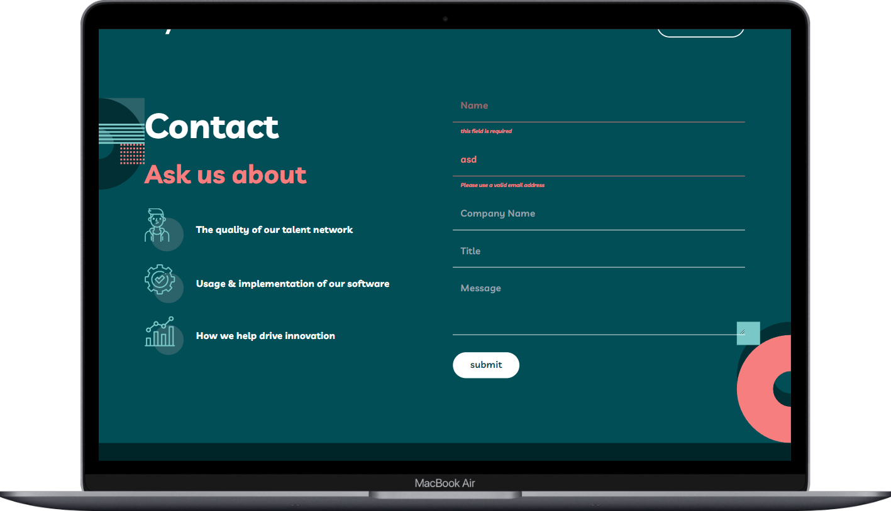
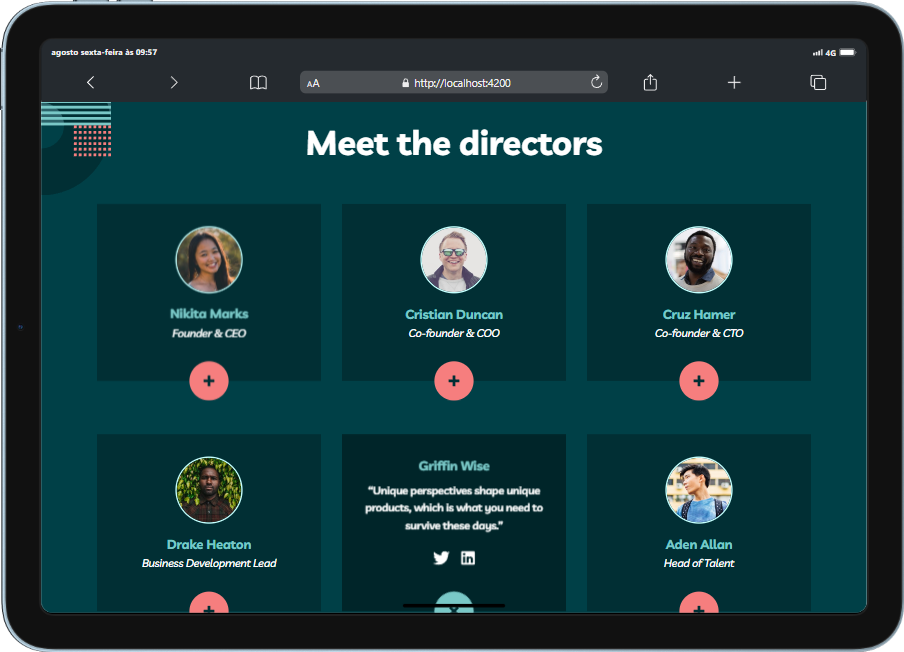
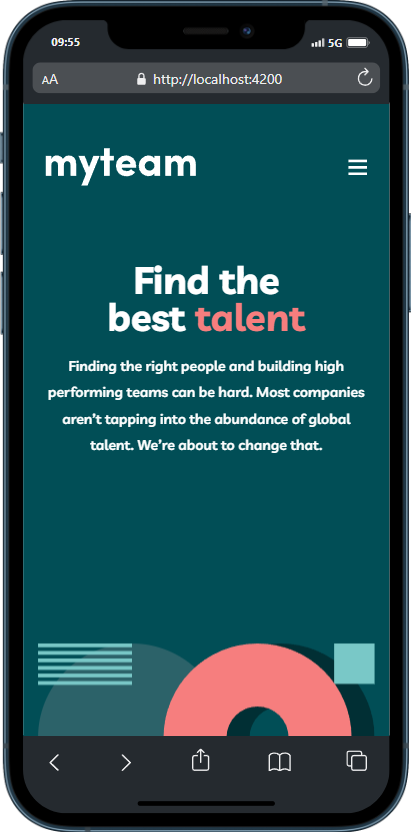

# Frontend Mentor - myteam website solution

This is a solution to the [myteam website challenge on Frontend Mentor](https://www.frontendmentor.io/challenges/myteam-multipage-website-mxlEauvW). Frontend Mentor challenges help you improve your coding skills by building realistic projects.

## Table of contents

- [Overview](#overview)
  - [The challenge](#the-challenge)
  - [Screenshot](#screenshot)
  - [Links](#links)
- [My process](#my-process)
  - [Built with](#built-with)
  - [What I learned](#what-i-learned)
  - [Continued development](#continued-development)
  - [Useful resources](#useful-resources)
- [Author](#author)


## Overview

### The challenge

Users should be able to:

- View the optimal layout for each page depending on their device's screen size
- See hover states for all interactive elements throughout the site
- See the correct content for each team member on the About page when the `+` icon is clicked
- Receive an error message when the contact form is submitted if:
  - The `Name`, `Email Address` or `Message` fields are empty should show "This field is required"
  - The `Email Address` is not formatted correctly should show "Please use a valid email address"

### Screenshot





### Links

- Solution URL: [Add solution URL here](https://github.com/GendPh/myteam-multi-page-website)
- Live Site URL: [Add live site URL here](frontendmentor-myteam-challenge.netlify.app)

## My process

### Built with

- Semantic HTML5 markup
- CSS custom properties
- Flexbox
- CSS Grid
- Mobile-first workflow
- [Angular](https://angularjs.org/) - JS library
- [EmailJs](https://www.emailjs.com/) - Send Email and Reply
- [Tailwindcss](https://tailwindcss.com/) - For styles
- [Animate](https://animate.style/) - For animations

### What I learned

```html
<div
  class="form-input"
  [ngClass]="{'error': emailModel.invalid && emailModel.touched, 'error fail-email':failedEmailValidation}"
>
  <input
    required
    [(ngModel)]="details.email"
    type="email"
    name="email"
    id="email"
    placeholder="Email"
    class="letter-spacing"
    #emailModel="ngModel"
  />
</div>
```

```js
 ngAfterViewInit(): void {
    // This observer will check if the component is in the viewport of the user
    const observer = new IntersectionObserver(
      ([entry]) => {
        if (entry.isIntersecting) {
          this.isInViewport = true;
          observer.unobserve(this.elementRef.nativeElement);
        }
      },
      { threshold: 0.6 }
    );

    observer.observe(this.elementRef.nativeElement);
  }

  // Method to toggle the description
  public toggleDesc() {
    if (this.firstClick === 0) {
      this.firstClick++;
    }
    this.descOpen = !this.descOpen;
  }
```

### Room for Improvement: Contact Forms

In future projects, I want to focus on refining my skills in building effective and user-friendly contact forms. While I’ve developed functional forms, I see room for improvement in areas such as validation, accessibility, and user experience. My goal is to ensure that the forms I create are not only visually appealing but also intuitive and fully optimized for all users. I plan to dive deeper into best practices and explore advanced techniques to perfect this essential aspect of web development.

### Useful resources

- [EmailJs](https://www.emailjs.com/) - This helped me to set up the contact form to send email for me and resend and thank you for the email the user insert
- [Animate](https://animate.style/) - This resource help me set up the animations by classes to the elements when in view port

## Author

- Website - [Gabriel Ferreira](https://gabriel-pf.netlify.app/)
- Frontend Mentor - [@GendPh](https://www.frontendmentor.io/profile/GendPh)
- Github - [@GendPh](https://github.com/GendPh)
